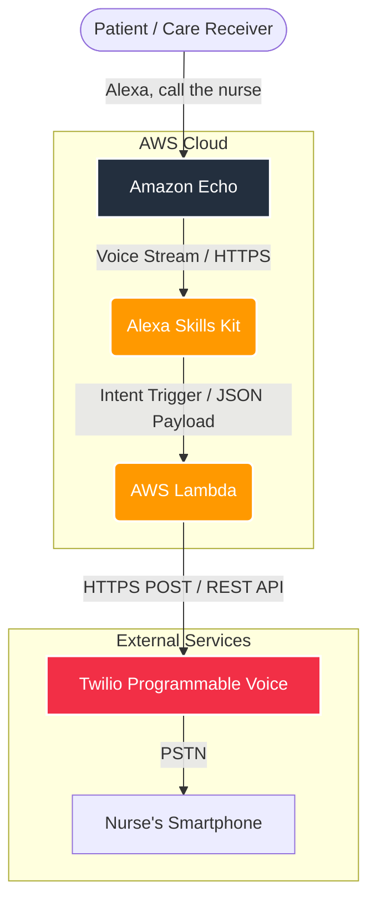

# serverless-care-alert-system
# Alexa Voice-Activated Nurse Call System

A serverless, voice-activated emergency alert system designed for home care and visiting nurses. This project allows patients or elderly users to call for assistance hands-free via Amazon Echo, triggering an automated phone call to the assigned nurse's smartphone.

  

## 🚀 Overview

When a user says *"Alexa, call the nurse,"* the system processes the request through the Alexa Skills Kit (ASK) and triggers an AWS Lambda function. The Lambda function interacts with the Twilio Programmable Voice API to initiate a regular PSTN phone call to the nurse, delivering a Text-to-Speech (TTS) emergency notification.

## 🏗️ System Architecture

## 🛠️ Tech Stack

* **Frontend / Interface:** Amazon Echo & Alexa Skills Kit (ASK)
* **Compute:** AWS Lambda (Serverless Architecture)
* **Telephony / Communications:** Twilio Programmable Voice API
* **Infrastructure Management:** AWS Management Console (or AWS SAM / CDK for future enhancements)

## 📋 Prerequisites

Before deploying this system, ensure you have the following accounts and tools:

1. **AWS Account** with permissions to manage Lambda functions and IAM roles.
2. **Amazon Developer Account** to build and configure the Alexa Skill.
3. **Twilio Account** with an active virtual phone number (e.g., 050 or local number capable of making outbound calls).

## ⚙️ Environment Variables

The AWS Lambda function requires the following environment variables to securely connect to the Twilio API:

| Variable Name | Description | Example |
| :--- | :--- | :--- |
| `TWILIO_ACCOUNT_SID` | Your Twilio Account SID | `ACxxxxxxxxxxxxxxxxxxxxxxxxxxxxxxxx` |
| `TWILIO_AUTH_TOKEN` | Your Twilio Auth Token (Keep this secret) | `your_auth_token_here` |
| `TWILIO_FROM_NUMBER` | The Twilio virtual number used to place the call | `+8150XXXXXXXX` |
| `NURSE_PHONE_NUMBER` | The target phone number of the nurse/caregiver | `+8190XXXXXXXX` |

## 🚀 Setup & Deployment Step-by-Step

### 1. Twilio Setup
* Log in to the Twilio Console and purchase a voice-enabled phone number.
* Note down your `Account SID` and `Auth Token`.

### 2. AWS Lambda Setup
* Create a new Lambda function from scratch (Node.js or Python recommended).
* Configure the basic execution IAM role with standard CloudWatch Logging permissions.
* Add the required Twilio Environment Variables.
* Add the **Alexa Skills Kit** as an event trigger (Ensure you enable Skill ID verification once the skill is created).

### 3. Alexa Skill Setup
* Go to the [Alexa Developer Console](https://developer.amazon.com/alexa/console/ask) and create a new custom skill.
* Define a custom intent named `CallNurseIntent`.
* Add sample utterances such as:
    * *"call the nurse"*
    * *"help me"*
    * *"I need a nurse"*
* Build the Interaction Model.
* In the **Endpoint** section, select **AWS Lambda ARN** and paste your Lambda function's ARN.

## 🛡️ Error Handling & Resiliency (SA Considerations)

* **API Failures:** If the Twilio API returns a non-200 response (e.g., due to insufficient balance), the Lambda function handles the exception and instructs Alexa to respond with an error message (*"Sorry, I couldn't reach the nurse. Please try again or use your emergency button."*).
* **Security:** Alexa requests are validated using the `Skill ID` constraint on the Lambda trigger to prevent unauthorized execution.

## 📝 License

This project is open-source and available under the [MIT License](LICENSE).
