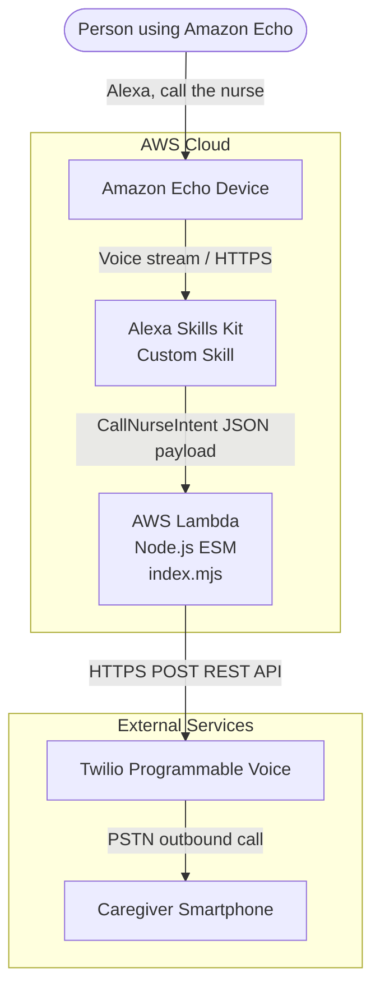

# EchoCare — Voice-Triggered Alert Research Prototype (Alexa + Twilio)

A serverless research prototype that lets a person say "Alexa, call the nurse" to trigger
an automated PSTN phone call to a pre-configured caregiver number via Twilio.
Built to explore the feasibility of hands-free alert delivery in home-care settings.

**Status:** Research Prototype · [https://veai.jp/apps/echocare/](https://veai.jp/apps/echocare/)

> EchoCare is an early-stage research prototype. **Not currently available for clinical
> or emergency use.** The current implementation calls a single hard-coded phone number.
> Multi-user routing, response tracking, and integration with professional care systems
> are areas for future research.

---

## Status & Limitations

| State | Detail |
|---|---|
| Working | Alexa skill receives voice intent and triggers a Twilio outbound PSTN call |
| Working | Japanese TTS message delivered to one pre-configured phone number |
| Working | LaunchRequest / HelpIntent / StopIntent / CancelIntent handled |
| Working | Twilio API error caught and surfaced as Alexa speech error message |
| Limitation | Single target phone number per deployment (`NURSE_PHONE_NUMBER` env var) |
| Limitation | No delivery confirmation or retry logic |
| Limitation | No user identity — any person speaking to the linked Echo device can trigger |
| Future research | Multi-user / multi-recipient routing, acknowledgment tracking, escalation flows |

This prototype is intended to demonstrate technical feasibility and inform research
directions. It does not constitute a verified safety system.

---

## Architecture


```mermaid
graph TD
    User([Person using Amazon Echo]) -->|"Alexa, call the nurse"| Echo[Amazon Echo Device]

    subgraph AWS Cloud
        Echo -->|Voice stream / HTTPS| ASK[Alexa Skills Kit\nCustom Skill]
        ASK -->|CallNurseIntent JSON payload| Lambda[AWS Lambda\nNode.js ESM\nindex.mjs]
    end

    subgraph External Services
        Lambda -->|HTTPS POST REST API| Twilio[Twilio Programmable Voice]
        Twilio -->|PSTN outbound call| Phone[Caregiver Smartphone]
    end
```

**Call flow (code-verified):**

1. Echo sends intent JSON to Alexa Skills Kit.
2. ASK validates Skill ID and forwards to Lambda.
3. Lambda calls `twilio.calls.create()` with a Japanese TTS TwiML string
   (`<Say language="ja-JP">`).
4. On success, Lambda responds to Alexa: "看護師に連絡しました。もうしばらくお待ちください。"
5. On Twilio API failure, Lambda responds with an error message and logs to CloudWatch.

---

## Tech Stack

| Layer | Technology |
|---|---|
| Voice interface | Amazon Echo / Alexa Skills Kit (custom skill, `CallNurseIntent`) |
| Compute | AWS Lambda — Node.js ESM (`index.mjs`) |
| Telephony | Twilio Programmable Voice API v2010 (`twilio` npm ^6.0.2) |
| Infrastructure | AWS Management Console (no IaC at this stage) |
| Monitoring | AWS CloudWatch Logs (Lambda default) |

---

## Environment Variables

| Variable | Description |
|---|---|
| `TWILIO_ACCOUNT_SID` | Twilio Account SID |
| `TWILIO_AUTH_TOKEN` | Twilio Auth Token (keep secret — use Lambda env encryption) |
| `TWILIO_FROM_NUMBER` | Twilio virtual number for outbound calls (e.g. `+8150XXXXXXXX`) |
| `NURSE_PHONE_NUMBER` | Single target number to call (e.g. `+8190XXXXXXXX`) |

---

## Testing

No automated test suite is present in this repository. The `package.json` test script
exits with an error placeholder. Validation has been performed manually against the
Alexa developer console simulator and a live Twilio account.

Recommended next steps for testing:
- Unit-test the Lambda handler by mocking the Twilio client
- Validate Skill ID verification on the Lambda trigger
- Add an end-to-end smoke test using the Alexa Simulator API

---

## Local Development

```bash
npm install

# Invoke handler locally with a mock Alexa LaunchRequest
node -e "
import('./index.mjs').then(({ handler }) =>
  handler({ request: { type: 'LaunchRequest' } }).then(console.log)
)
"
```

To test a `CallNurseIntent` locally, set the four Twilio environment variables in your
shell before invoking. Outbound calls will be real — use a Twilio test number or
set `NURSE_PHONE_NUMBER` to your own number during development.

---

## Deployment

Manual deployment via AWS Management Console or AWS CLI:

1. **Twilio:** Create a voice-enabled number; note `Account SID` and `Auth Token`.
2. **Lambda:** Create a function (Node.js 20+, ESM). Upload `index.mjs` + `node_modules`.
   Add the four environment variables. Set the Alexa Skills Kit as a trigger with Skill ID
   verification enabled.
3. **Alexa Developer Console:** Create a custom skill with intent `CallNurseIntent` and
   sample utterances ("call the nurse", "help me", "I need a nurse"). Set the Lambda ARN
   as the endpoint.

---

## 日本語

Amazon Echo に「看護師を呼んで」と話しかけると、Twilio 経由で事前設定した電話番号へ
自動音声通話を発信する、サーバーレスの研究プロトタイプです。
現在の実装は通話先が1件固定であり、応答確認・複数受信者ルーティング・既存ナースコール設備との
連携は将来の研究課題です。臨床・緊急用途での利用はできません。

---

## License

MIT License

---

Part of the [VEAI LAB.](https://veai.jp) ecosystem · [Product page](https://veai.jp/apps/echocare/)
